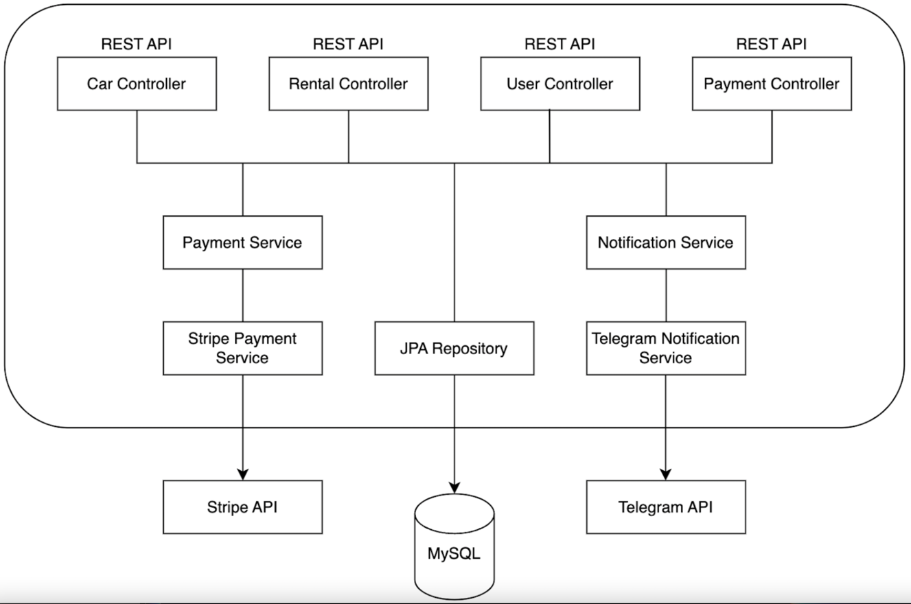

## Overview:
This is a Car Sharing Service management system, a Java-based web application designed to automate medium or large size business processes related to managing car inventory, rentals, customers, payments, and notifications. This system will replace outdated manual record-keeping methods with efficient online management tools, enhancing both administrative tasks and user experience.
## Technologies Used
The project is developed using the following technologies and tools:
- **Java(17)**
- **Spring Boot**
- **Spring Security**
- **Spring Data JPA**
- **MySQL DB**
- **H2 Database** (embedded for development purposes)
- **Swagger** (for API documentation)
- **Jakarta Validation**
- **Docker**
- **Testcontainers**, **JUnit**
- **Maven** (for project management)
- ***Stripe API*** (for handling payment processes)
- ***Telegram API*** (for convenient messaging system for users)

## Architecture

Problems solved:
> ***Manual Record-Keeping, Limited Visibility, Cash-Only Payments, Inefficient Communication, Lack of Scalability, Security Risks***

>***Abilities:***
- _**Functional**_:
    - Web-based
    - Manage car sharing inventory
    - Manage car rentals
    - Manage customers
    - Display notifications
    - Handle payments
- _**Non-functional:**_
    - Support up to 5 concurrent users
    - Manage up to 1000 cars
    - Handle 50,000 rentals per year
    - Approximately 30MB of data per year
## Controllers:

1. **Authentication Controller**:
    - POST: /register - Register a new user
    - POST: /login - Obtain JWT tokens for authentication

2. **Users Controller**:
    - PUT: /users/{id}/role - Update user role
    - GET: /users/me - Get user profile information
    - PUT/PATCH: /users/me - Update user profile

3. **Cars Controller**:
    - POST: /cars - Add a new car to the inventory
    - GET: /cars - Retrieve a list of available cars
    - GET: /cars/{id} - Retrieve detailed information about a specific car
    - PUT/PATCH: /cars/{id} - Update car details
    - DELETE: /cars/{id} - Delete a car from the inventory

4. **Rentals Controller**:
    - POST: /rentals - Create a new rental request
    - GET: /rentals/?user_id=...&is_active=... - Retrieve rentals by user ID and active status
    - GET: /rentals/{id} - Retrieve details of a specific rental
    - POST: /rentals/{id}/return - Set actual return date for a rental

5. **Payments Controller (Stripe)**:
    - GET: /payments/?user_id=... - Retrieve payment history for a user
    - POST: /payments/ - Initiate a payment session for a rental
    - GET: /payments/success/ - Handle successful payment redirection from Stripe
    - GET: /payments/cancel/ - Handle payment cancellation redirection from Stripe

## Notifications Service (Telegram):
Telegram Bot with chat for posting notifications. Integrated sending notifications on new rental creation, providing information about the rental in the message.

## Payment Service (Stripe)
Stripe API used to create payment sessions, calculate the total price of the rental. Created  payment is  storing the session URL and session ID. Rental processes are attached to the Payments.
## Setup and Usage

### Requirements
- Java-17 or above
- MySQL server 8.0.36 or above
- Apache Maven 3.6.3 or above
- Docker 25.0.3 or above
- Git latest version
- Stripe account
- Telegram account and Bot Father bot
### Instalation
To set up and use the project:
1. Clone the repository:
   `https://github.com/luk14n/online-car-sharing-app.git`
1. Build the project using Maven:
   `mvn -X clean package`.
3. Run the application: `java -jar target/*.jar`.
   or just hit play button if using Inteliji IDEA
1. Access the Swagger documentation at `http://localhost:8080/swagger-ui.html` for detailed API information.

## Conclusion:
With the help of this service you will be able to automate manual and low leverage actions thus it will help to concentrate on marketing and client oriented processes letting Car Sharing Service to take care of management. It is also highly maintainable app due to usage of architectural patterns and technologies as Docker or Liquibase which will allow you to add new features and do not worry about compatibility issues.   
